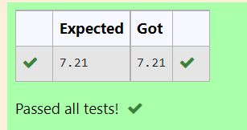

# DISTANCE-BETWEEN-TWO-POINTS

## AIM:
To write a python program to find the distance two 2 points
## ALGORITHM:
### Step 1:
Get two inputs from use
### Step 2: 
Initialize the values into variables
### Step 3: 
Substitute the values in the distance formula  
### Step 4: 
Store the answer in a variable
### Step 5: 
Print the answer

### PROGRAM:
```
#Program to find the distance between two points.
#Developed by:Aadhithya.M
#RegisterNumber:22003465
import numpy as np
l1=[10,6]
l2=[4,2]
distance=np.sqrt(((l1[0]-l2[0])**2)+((l1[1]-l2[1])**2))
print("{:.2f}".format(distance))
```


### OUTPUT:


### RESULT:
Thus findings of distance between two points are successfully executed.
